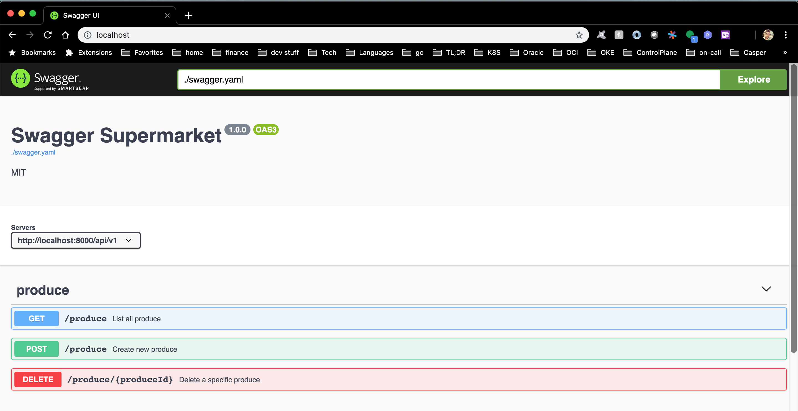

# Supermarket API


## How to run

### Machine Requirements:
* docker 

### Steps To Run
Pull the image from dockerhub. 
Note the latest build of master will be the latest tag.
```
docker pull xmattstrongx/supermarket
```

Run the image choosing a port you would like to expose
```
docker run --rm -it -p 8080:8080 xmattstrongx/supermarket
```

## API Documentation

The API is documented using swagger openapi spec 3.0.

To view the swagger api documentation run the swagger make target
```
make swagger
docker run --rm -p 80:8080 -e "SWAGGER_JSON=/spec/swagger.yaml" -v /Users/matthewstrong/go/modules/github.com/xmattstrongx/supermarket/swagger/spec:/spec swaggerapi/swagger-ui
```

Next open a browser to localhost



## Devflow

To test, build and run the code locally use the deploy make target.

```
make deploy
```

## CLI

To interact with the API you can use the CLI client.

To install this locally run 

```
make install
```

This will install the supermarket binary in to the bin of your gopath.

Example Usage:

For this example I open one window and run `make deploy` to run my latest code.

In another window after `make install` I interact with the supermarket client CLI.

### Create Produce Example

```
supermarket produce create --request '[{"name":"fumanchu","produceCode":"XX1X-4GH7-QPL9-3N4M","unitPrice": 1.13333}]'
http://localhost:8000/api/v1/produce
Status Code: 201
{"created":[{"name":"fumanchu","produceCode":"XX1X-4GH7-QPL9-3N4M","unitPrice":1.13}],"createFailed":[]}

supermarket produce create --request '[{"name":"fumanchu","produceCode":"XX1X-4GH7-QPL9-3N4M","unitPrice": 1.13333}]'
http://localhost:8000/api/v1/produce
Status Code: 400
{"created":[],"createFailed":[{"name":"fumanchu","produceCode":"XX1X-4GH7-QPL9-3N4M","unitPrice":1.13333}]}

supermarket produce create --request '[{"name":"fumanchu","produceCode":"XX1X-4GH7-QPL9-3N4M","unitPrice": 1.13333},{"name":"oomanchu","produceCode":"2222-4GH7-QPL9-3N4M","unitPrice": 1.13333}]'
http://localhost:8000/api/v1/produce
Status Code: 207
{"created":[{"name":"oomanchu","produceCode":"2222-4GH7-QPL9-3N4M","unitPrice":1.13}],"createFailed":[{"name":"fumanchu","produceCode":"XX1X-4GH7-QPL9-3N4M","unitPrice":1.13333}]}
```

### List Produce Example

```
supermarket produce list
http://localhost:8000/api/v1/produce
Status Code: 200
[{"name":"Lettuce","produceCode":"A12T-4GH7-QPL9-3N4M","unitPrice":3.46},{"name":"Peach","produceCode":"E5T6-9UI3-TH15-QR88","unitPrice":2.99},{"name":"Green Pepper","produceCode":"YRT6-72AS-K736-L4AR","unitPrice":0.79},{"name":"Gala Apple","produceCode":"TQ4C-VV6T-75ZX-1RMR","unitPrice":3.59},{"name":"fumanchu","produceCode":"XX1X-4GH7-QPL9-3N4M","unitPrice":1.13},{"name":"oomanchu","produceCode":"2222-4GH7-QPL9-3N4M","unitPrice":1.13}]
```

### Delete Produce Example

```
supermarket produce delete A12T-4GH7-QPL9-3N4M
http://localhost:8000/api/v1/produce/A12T-4GH7-QPL9-3N4M
Status Code: 204
""
```


